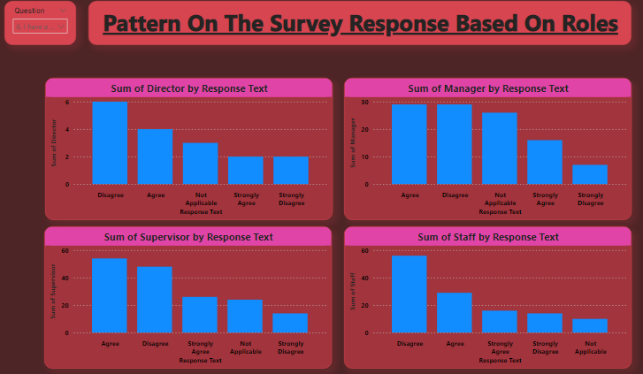

# Employee-Survey

## Introduction

This is a power BI project on HR Survey called **Employee Survey Responses**. 
The project are actual responses from an employee engagement survey conducted by Pierce County WA and completed voluntarily by government employees. 
The dataset is a Single table and contains 14,725 records. The total number of fields is 10.

## Problem Statement 
- Which survey questions did respondents agree with or disagree with most?
 - Do you see any patterns or trends by department or role?
- As an employer, what steps might you take to improve employee satisfaction based on the survey results?

## Skills/ Concepts Demonstrated:

 - Data cleaning
- New measure
- Transforming data
 - Modeling etc.

## DATA SOURCING

It’s a survey response from employees conducted by Pierce Country Wa and completed by government employees. Link: https://docs.google.com/spreadsheets/d/1nbhfp2ModgqDAPveYQG9CknRw2PYJQxbOTs3xSKOB8E/edit#gid=61186505

## DATA TRANSFORMATION
 
 Data was efficiently cleaned transformed with the power Query Editor of power BI.[a screenshot of some steps applied] Steps includes;
- Making first row as header 
- Value to find and Replace value 
- Datatype then Change from Decimal or text to whole number
- Close and apply

 ## DATA MODELING
  
Power BI automatically connected related tables resulting in a Vertical model. ’Employee Survey’ table is the model

## ANALYSIS AND VISUALIZATION
It comprises of two pages which are employee survey and patterns and trends by roles or departments.

From the dashboard its shows that employees mostly agreed on Question 1 while others mostly disagreed on Question 6.

It also shows the patterns by roles which implies that 
- 	13 strongly agreed,2 agree,1 not applicale,1 strongly disagree,0disagree as per Director
- 	107 strongly agreed,51agree,4not applicale,2strongly disagree,2disagree as per supervisor
- 	65 strongly agreed,29agree,3not applicale,2 strongly disagree,8disagree as per Manager
- 	67 strongly agreed,39 agree,14not applicale,3 strongly disagree,2disagree as per Staff

It also shows the patterns by roles which implies that 
- 	9strongly agreed,6 agree,1 not applicale,1strongly disagree,0disagree as per Director
- 	80 strongly agreed,63agree,0not applicale,5strongly disagree,17disagree as per supervisor
- 	44 strongly agreed,42 agree,3not applicale,3 strongly disagree,15disagree as per Manager
- 	58 strongly agreed,39 agree,2not applicale,3 strongly disagree,23disagree as per staff

It also shows the patterns by roles which implies that 
- 	8 strongly agreed, 5 agree,3 not applicale,1 strongly disagree,0disagree as per Director
- 	50 strongly agreed,69agree,4not applicale,12strongly disagree,31disagree as per supervisor
- 	44 strongly agreed,32 agree,6not applicale,10 strongly disagree,15disagree as per Manager
- 	26 strongly agreed,48 agree,0not applicale,17 strongly disagree,34disagree as per Staff

It also shows the patterns by roles which implies that 
- 	6 strongly agreed,6 agree,4 not applicale,1 strongly disagree,0disagree as per Director
- 	85 strongly agreed,61agree,2not applicale,4strongly disagree,14disagree as per supervisor
- 	65 strongly agreed,31 agree,3not applicale,3strongly disagree,6disagree as per Manager
- 	54 strongly agreed,49 agree,3not applicale,5strongly disagree,14disagree as per Staff

It also shows the patterns by roles which implies that 
- 	13 strongly agreed,2 agree,1 not applicale,1 strongly disagree,0disagree as per Director
- 	71strongly agreed,71agree,2not applicale,11strongly disagree,11disagree as per supervisor
- 	61 strongly agreed,32 agree,4not applicale,7 strongly disagree,3disagree as per Manager
- 	34 strongly agreed,60 agree,4not applicale,8 strongly disagree,19disagree as per Staff

It also shows the patterns by roles which implies that 
- 	2 strongly agreed,4 agree,3 not applicale,2strongly disagree,6disagree as per Director
- 	26 strongly agreed,54agree,24not applicale,14strongly disagree,48disagree as per supervisor
- 	16 strongly agreed,52 agree,26not applicale,7strongly disagree,29disagree as per Manager
-  16 strongly agreed,29 agree,10not applicale,14strongly disagree,56disagree as per Staff.

## CONCLUSION/ RECONMENDATION
The analysis of the Employee Survey Responses from Pierce County WA reveals several key areas where improvements can be made to enhance employee satisfaction. By focusing on improving communication, managing workloads, supporting professional development, fostering a positive work environment, and regularly gathering feedback, Pierce County can create a more engaged and motivated workforce.

**Key Takeaways**:
- 	Communication: Increase transparency and frequency of communication from management.
- 	Workload: Balance workloads and provide resources for stress management.
- 	Professional Development: Offer more training and clear advancement opportunities.
- 	Work Environment: Promote a positive, inclusive, and collaborative culture.
- 	Feedback Mechanism: Implement regular surveys and ensure actions are taken based on feedback. Implementing these recommendations can lead to higher employee satisfaction, better retention rates, and overall improved organizational performance. Regularly reviewing and adjusting strategies based on employee feedback will ensure that Pierce County remains responsive to its employees' needs and fosters a supportive workplace culture.

 

 
